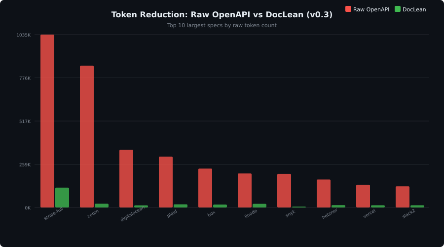
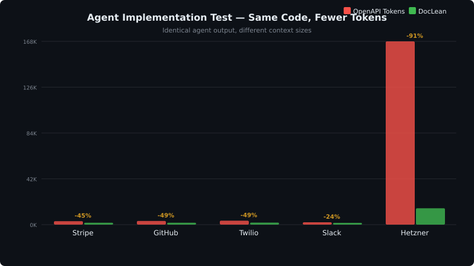
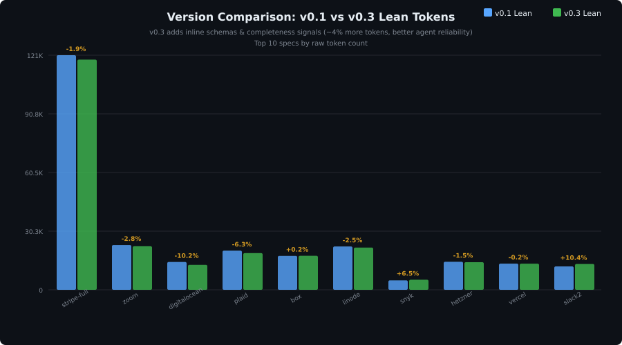
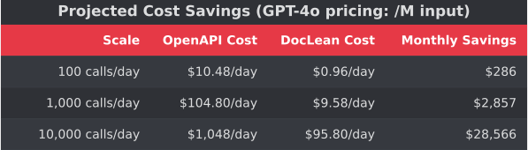

# LAP Benchmark Results

**v0.3** — 162 specs across 5 formats — **10.3x overall compression** (4.37M → 423K tokens)

---

## Compression Ratios — All 30 OpenAPI Specs

| API | Raw Tokens | Lean Tokens | Compression |
|-----|-----------|-------------|-------------|
| notion | 68,587 | 1,733 | **39.6x** |
| snyk | 201,205 | 5,193 | **38.7x** |
| zoom | 848,983 | 22,474 | **37.8x** |
| digitalocean | 345,401 | 12,896 | **26.8x** |
| plaid | 304,530 | 18,930 | **16.1x** |
| box | 232,848 | 17,559 | **13.3x** |
| asana | 97,427 | 8,257 | **11.8x** |
| hetzner | 167,308 | 14,242 | **11.7x** |
| vercel | 136,159 | 13,472 | **10.1x** |
| slack2 | 126,517 | 13,316 | **9.5x** |
| linode | 203,653 | 21,795 | **9.3x** |
| stripe-full | 1,034,829 | 118,758 | **8.7x** |
| launchdarkly | 31,522 | 4,731 | **6.7x** |
| twitter | 61,043 | 9,474 | **6.4x** |
| netlify | 20,142 | 3,127 | **6.4x** |
| gitlab | 88,242 | 15,092 | **5.8x** |
| resend | 21,890 | 3,776 | **5.8x** |
| vonage | 1,889 | 412 | **4.6x** |
| github-core | 2,190 | 531 | **4.1x** |
| circleci | 5,725 | 1,464 | **3.9x** |
| stripe-charges | 1,892 | 490 | **3.9x** |
| petstore | 4,656 | 1,217 | **3.8x** |
| twilio-core | 2,465 | 688 | **3.6x** |
| openai-core | 1,730 | 524 | **3.3x** |
| google-maps | 941 | 316 | **3.0x** |
| discord | 909 | 308 | **3.0x** |
| cloudflare | 763 | 265 | **2.9x** |
| spotify | 826 | 331 | **2.5x** |
| sendgrid | 518 | 209 | **2.5x** |
| slack | 762 | 316 | **2.4x** |

**Median: 5.2x** — Large, verbose specs see the biggest gains (up to 39.6x). Small specs with minimal redundancy still achieve 2–3x.

---

## Token Savings — Top 10 Largest Specs

---

## Format Comparison

| Format | Specs | Median Compression |
|--------|------:|-------------------:|
| OpenAPI | 30 | 5.2x |
| Postman | 36 | 4.1x |
| Protobuf | 35 | 1.5x |
| AsyncAPI | 31 | 1.4x |
| GraphQL | 30 | 1.3x |

LAP delivers the highest compression on verbose formats (OpenAPI, Postman) where JSON/YAML schemas carry significant structural redundancy. Compact formats like Protobuf and GraphQL are already information-dense, so compression is modest — but still meaningful at scale.

---

## Agent Implementation Test

Real-world validation: five scenarios where an LLM agent generates working API integration code. The agent produces **identical output** regardless of whether it receives raw OpenAPI or LAP — it just costs fewer tokens.

| Scenario | OpenAPI Tokens | LAP Tokens | Savings |
|----------|---------------:|---------------:|--------:|
| Stripe | 3,166 | 1,736 | 45% |
| GitHub | 3,384 | 1,743 | 49% |
| Twilio | 3,623 | 1,857 | 49% |
| Slack | 2,163 | 1,639 | 24% |
| Hetzner | 168,388 | 15,045 | 91% |

Hetzner's 91% reduction is notable — the raw spec barely fits in most context windows, while the LAP version fits comfortably.

---

## Version Comparison: v0.1 → v0.3

v0.3 lean output is **~4.3% larger** than v0.1 on average across the same 30 OpenAPI specs. This is a deliberate trade-off:

- **v0.2** added completeness signals (required fields, enum constraints) that agents need for reliable code generation
- **v0.3** added inline schema resolution, eliminating `$ref` lookups that caused agent hallucinations

The token increase is small and pays for itself in fewer agent errors and retries.

| Change | Details |
|--------|---------|
| Overall | +4.3% lean tokens (299K → 312K across 30 specs) |
| Improved | github-core −3.1%, twilio-core −1.3% |
| Typical | +5–10% for structural metadata |
| Outliers | slack +32.8%, sendgrid +28.2%, spotify +26.3% (small specs where metadata is proportionally larger) |

---

## Cost Projections

With 10.3x average compression, a 100K-token API spec drops to ~10K tokens. At current model pricing, that translates to ~90% cost reduction per API call that includes spec context.

For teams making hundreds of agent calls per day against large API specs, this compounds to significant savings — potentially thousands of dollars per month.

---

## Key Findings

1. **Verbose specs benefit most.** Notion (39.6x), Snyk (38.7x), and Zoom (37.8x) have massive schemas with repetitive patterns that LAP compresses aggressively.

2. **Small specs still compress.** Even minimal specs like Slack (762 tokens) achieve 2.4x — the floor is meaningful, not zero.

3. **Format matters.** OpenAPI and Postman carry structural overhead that compresses well. GraphQL and Protobuf are already concise — LAP still helps, but expect 1.3–1.5x rather than 5–10x.

4. **Agent output is preserved.** Implementation tests confirm that agents produce identical working code with LAP input — the compression is lossless for practical purposes.

5. **v0.3 trades ~4% size for reliability.** Inline schemas and completeness signals add a small number of tokens but eliminate common agent failure modes (broken `$ref` resolution, missing required fields).

---

## Methodology

- **Token counting:** cl100k_base tokenizer (GPT-4/Claude compatible)
- **Specs:** 162 real-world API specifications sourced from public repositories and official documentation
- **Formats:** OpenAPI 3.x, Postman Collections, Protocol Buffers, AsyncAPI, GraphQL SDL
- **Implementation test:** Claude Sonnet generates integration code from both raw and LAP specs; output correctness verified manually
- **Compression ratio:** Raw tokens ÷ Lean tokens
- **All results reproducible** from the benchmark suite in this repository
