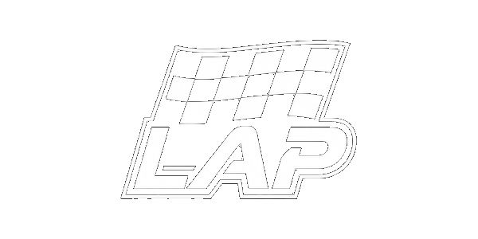
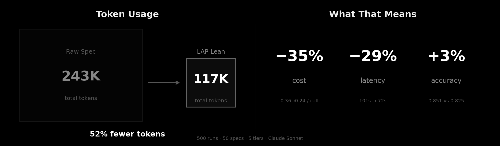
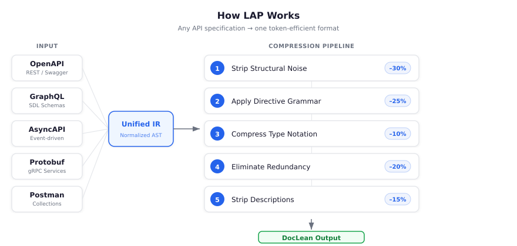
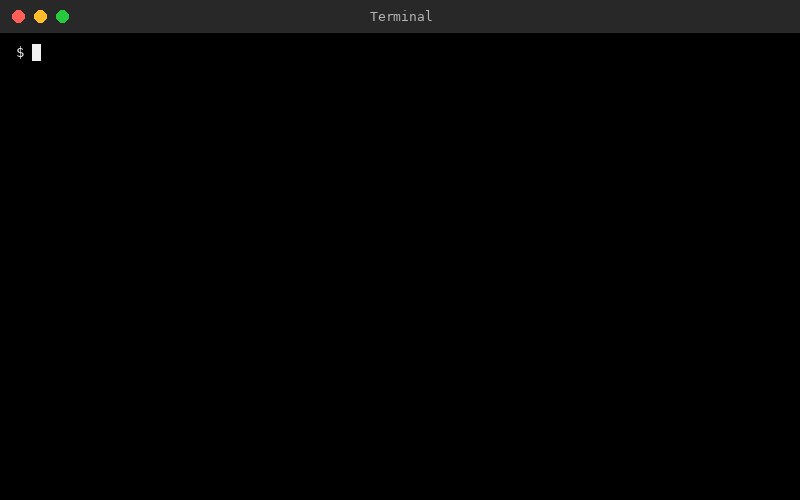
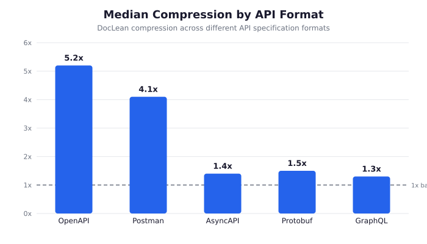

<div align="center">

<picture>
  <source media="(prefers-color-scheme: dark)" srcset="assets/readme-logo-dark.png">
  <source media="(prefers-color-scheme: light)" srcset="assets/light/readme-logo-light.png">
  
</picture>

# Lean API Platform

**Agent-Native API specs. Verified, compressed, ready to install.**

<a href="https://pypi.org/project/lapsh/"></a>
<a href="https://github.com/Lap-Platform/lap/actions/workflows/ci.yml"></a>
<a href="https://www.npmjs.com/package/@lap-platform/lapsh"></a>
<br>
<a href="https://github.com/Lap-Platform/lap/tree/main/skills/lap"></a>
<a href="https://clawhub.ai/mickmicksh/lap"></a>
<br>
<a href="https://github.com/Lap-Platform/lap/pulls"></a>
<a href="https://github.com/Lap-Platform/lap"></a>
<br>
<a href="LICENSE"></a>

[Website](https://lap.sh) · [Registry](https://lap.sh) · [Benchmarks](https://github.com/Lap-Platform/Lap-benchmark-docs) · [Docs](docs/)

</div>

---

Without API documentation, LLM agents hallucinate endpoints, invent parameters, and guess auth flows -- scoring just **0.399 accuracy** in blind tests.

LAP fixes this. One command gives your agent a verified, agent-native API spec -- jumping accuracy to **0.860**. And because LAP specs are 10x smaller than raw OpenAPI, you also save 35% on cost and run 29% faster.

**Not minification** -- a purpose-built compiler with its own grammar.

### Proven in 500 blind runs across 50 APIs

<p align="center">
  <picture>
    <source media="(prefers-color-scheme: dark)" srcset="assets/benchmark_savings.png">
    <source media="(prefers-color-scheme: light)" srcset="assets/light/benchmark_savings.png">
    
  </picture>
</p>

LAP Lean scored **0.851** (vs 0.825 raw) while using **35% less cost** and **29% less time** -- same accuracy, far fewer tokens.

> [Full benchmark report (500 runs, 50 specs, 5 formats)](https://lap-platform.github.io/Lap-benchmark-docs/results/LAP_Benchmark_v2_Full_Report.html) · [Benchmark methodology and data](https://github.com/Lap-Platform/Lap-benchmark-docs)

## Quick Start

```bash
# Search the registry for an API
npx @lap-platform/lapsh search payment

# Download a spec
npx @lap-platform/lapsh get stripe-com -o stripe.lap

# Install a pre-compiled skill (drops into ~/.claude/skills/)
npx @lap-platform/lapsh skill-install stripe-com

# Or compile your own spec
npx @lap-platform/lapsh compile api.yaml --lean
```

### Use as an Agent Skill

Install the LAP skill so your agent can search, compile, and manage APIs automatically:

**Claude Code:**
```bash
cp -r skills/lap ~/.claude/skills/lap
```

**OpenClaw:** install from [ClawHub](https://clawhub.ai/mickmicksh/lap) or copy manually:
```bash
cp -r skills/lap ~/.openclaw/skills/lap
```

Once installed, agents auto-trigger the skill when working with APIs -- or invoke it directly with `/lap`. You can also install individual API skills for specific integrations:

```bash
npx @lap-platform/lapsh skill-install stripe-com
# Agent now knows the full Stripe API
```

> **Want to get listed?** [Register as a verified publisher](https://registry.lap.sh) and share your specs and skills with the registry.

```bash
# Install globally (npm or pip)
npm install -g @lap-platform/lapsh
pip install lapsh
```

## What You Get

- 🗜️ **5.2× median compression** on OpenAPI, up to 39.6× on large specs — **35% cheaper, 29% faster** ([benchmarks](BENCHMARKS.md))
- 📐 **Typed contracts** — `enum(a|b|c)`, `str(uuid)`, `int=10` prevent agent hallucination
- 🔌 **6 input formats** — OpenAPI, GraphQL, AsyncAPI, Protobuf, Postman, Smithy
- 🎯 **Zero information loss** — every endpoint, param, and type constraint preserved
- 🔁 **Round-trip** — convert back to OpenAPI with `lapsh convert`
- 📦 **Registry** — browse and install pre-compiled specs at [lap.sh](https://lap.sh)
- 🤖 **Skill generation** — `lapsh skill` creates agent-ready skills from any spec
- 🔗 **Integrations** — LangChain, CrewAI, OpenAI function calling, MCP

## How It Works

<p align="center">
  
</p>

Five compression stages, each targeting a different source of token waste:

| Stage | What it does | Savings |
|-------|-------------|--------:|
| **Structural removal** | Strip YAML scaffolding — `paths:`, `requestBody:`, `schema:` wrappers vanish | ~30% |
| **Directive grammar** | `@directives` replace nested structures with flat, single-line declarations | ~25% |
| **Type compression** | `type: string, format: uuid` → `str(uuid)` | ~10% |
| **Redundancy elimination** | Shared fields extracted once via `@common_fields` and `@type` | ~20% |
| **Lean mode** | Strip descriptions — LLMs infer meaning from well-named parameters | ~15% |

<p align="center">
  
</p>

## Benchmarks

**162 specs · 5,228 endpoints · 4.37M → 423K tokens**

<p align="center">
  <picture>
    <source media="(prefers-color-scheme: dark)" srcset="assets/format_comparison.png">
    <source media="(prefers-color-scheme: light)" srcset="assets/light/format_comparison.png">
    
  </picture>
</p>

| Format | Specs | Median | Best |
|--------|------:|-------:|-----:|
| **OpenAPI** | 30 | **5.2×** | 39.6× |
| **Postman** | 36 | **4.1×** | 24.9× |
| **Protobuf** | 35 | **1.5×** | 60.1× |
| **AsyncAPI** | 31 | **1.4×** | 39.1× |
| **GraphQL** | 30 | **1.3×** | 40.9× |

Verbose formats compress most — they carry the most structural overhead. Already-concise formats like GraphQL still benefit from type deduplication.

## The Ecosystem

LAP is more than a compiler:

| Component | What | Command |
|-----------|------|---------|
| **Search** | Find APIs in the registry | `lapsh search payment` |
| **Get** | Download a spec by name | `lapsh get stripe-com` |
| **Skill Install** | Install a pre-compiled skill | `lapsh skill-install stripe-com` |
| **Compiler** | Any spec → `.lap` | `lapsh compile api.yaml` |
| **Skill Generator** | Create agent-ready skills from any spec | `lapsh skill api.yaml --install` |
| **API Differ** | Detect breaking API changes | `lapsh diff old.lap new.lap` |
| **Round-trip** | Convert LAP back to OpenAPI | `lapsh convert api.lap -f openapi` |
| **Publish** | Share specs to the registry | `lapsh publish api.yaml --provider acme` |

> **Claude Code users:** The `lap-search` skill is included -- your agent can search and install APIs directly. See `skills/search/SKILL.md`.

## Supported Formats

```bash
lapsh compile  api.yaml           # OpenAPI 3.x / Swagger
lapsh compile  schema.graphql     # GraphQL SDL
lapsh compile  events.yaml        # AsyncAPI
lapsh compile  service.proto      # Protobuf / gRPC
lapsh compile  collection.json    # Postman v2.1
lapsh compile  model.smithy       # AWS Smithy
```

Format is auto-detected. Override with `-f openapi|graphql|asyncapi|protobuf|postman|smithy`.

## Top Compressions

<p align="center">
  <picture>
    <source media="(prefers-color-scheme: dark)" srcset="assets/compression_bar_chart.png">
    <source media="(prefers-color-scheme: light)" srcset="assets/light/compression_bar_chart.png">
    
  </picture>
</p>

## Integrations

```python
# LangChain
from lap.integrations import LAPLoader
docs = LAPLoader("stripe.lap").load()

# OpenAI function calling
from lap.integrations import to_openai_functions
functions = to_openai_functions("stripe.lap")
```

Also: CrewAI tool, MCP server and compression proxy. See [integration docs](docs/guide-integrate.md).

## FAQ

<details>
<summary><b>Why do agents hallucinate API calls?</b></summary>

Because they have no way to find the spec, and even if they could, it's a million tokens of YAML written for humans. Agents without specs score 0.399 accuracy -- wrong 60% of the time. They hallucinate endpoint paths, send invalid types, and miss auth. Give them a LAP spec and accuracy jumps to 0.860. The spec doesn't make the agent smarter. It makes guessing unnecessary.
</details>

<details>
<summary><b>How is this different from OpenAPI?</b></summary>

LAP doesn't replace OpenAPI — it compiles FROM it. Like TypeScript → JavaScript: you keep your OpenAPI specs, your existing tooling, everything. LAP adds a compilation step for the LLM runtime.
</details>

<details>
<summary><b>How is this different from MCP?</b></summary>

MCP defines how agents discover and invoke tools (the plumbing). LAP compresses the documentation those tools expose (the payload). They're complementary — LAP can compress MCP tool schemas.
</details>

<details>
<summary><b>Why not just minify the JSON?</b></summary>

Minification removes whitespace — that's ~10% savings. LAP performs semantic compression: flattening nested structures, deduplicating schemas, compressing type declarations, and stripping structural overhead. That's 5-40× savings. Different class of tool.
</details>

<details>
<summary><b>What about prompt caching?</b></summary>

Use both. Compress with LAP first, then cache the compressed version. LAP reduces the first-call cost and frees context window space. Caching reduces repeated-call cost. They stack.
</details>

<details>
<summary><b>Will LLMs understand this format?</b></summary>

Yes. LAP uses conventions LLMs already know — `@directive` syntax, `{name: type}` notation, HTTP methods and paths. In blind tests, agents produce identical correct output from LAP and raw OpenAPI. The typed contracts actually reduce hallucination.
</details>

<details>
<summary><b>What if token costs keep dropping?</b></summary>

Cost is the least important argument. The core value is typed contracts: `enum(succeeded|pending|failed)` prevents hallucinated values regardless of token price. Plus: formal grammar (parseable by code, not just LLMs), schema diffing, and faster inference from fewer input tokens.
</details>

## Contributing

See [CONTRIBUTING.md](CONTRIBUTING.md). The test suite has 545 tests across 177 example specs in 6 formats.

```bash
git clone https://github.com/Lap-Platform/lap.git
cd lap
pip install -e ".[dev]"
pytest
```

## License

[Apache 2.0](LICENSE) — See [NOTICE](NOTICE) for attribution.

---

<div align="center">

**[lap.sh](https://lap.sh)** · Built by the LAP team

</div>
