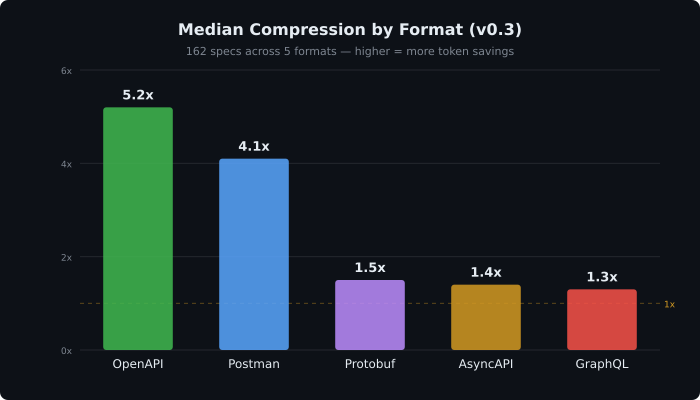
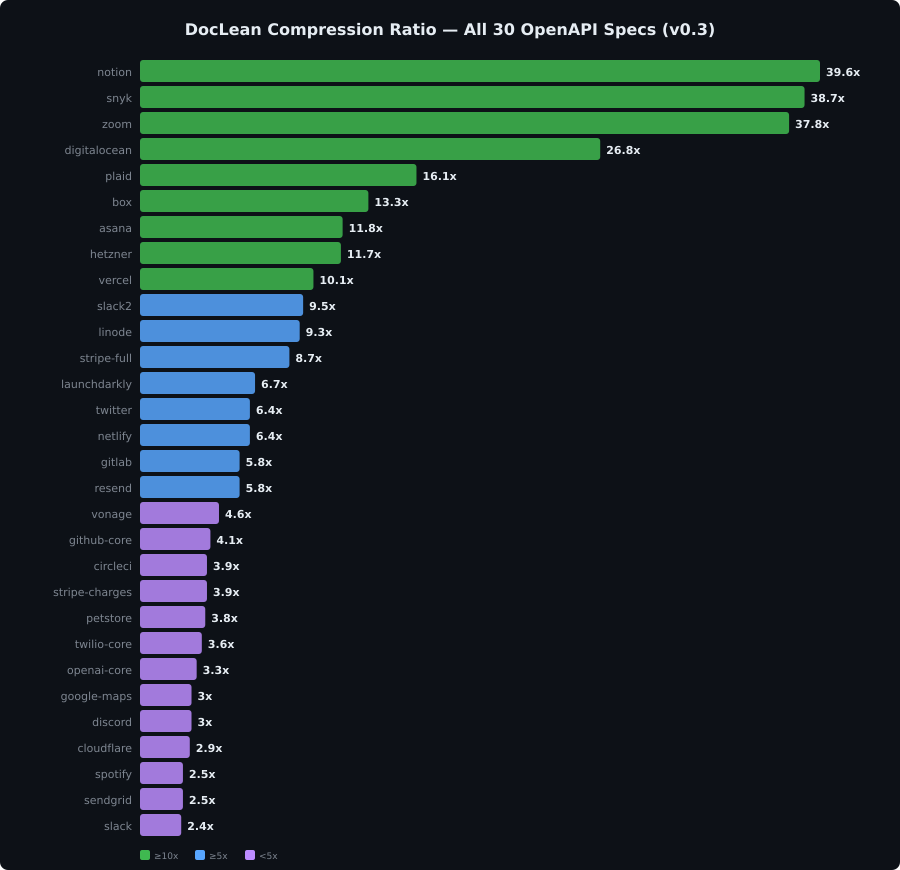
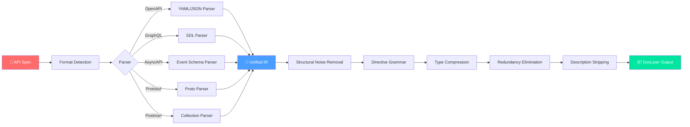

<div align="center">

# LAP — Lean Agent Protocol

**Cut API spec tokens by 10×. Same information. Fraction of the cost.**

[](https://pypi.org/project/lap/)
[](https://github.com/lean-agent-protocol/lap/actions/workflows/tests.yml)
[](LICENSE)
[](https://www.python.org/downloads/)

LAP compiles API specs into **DocLean** — a typed, token-efficient format built for AI agents.  
OpenAPI, GraphQL, AsyncAPI, Protobuf, Postman → one compact format.

</div>

## Why LAP?

LLMs waste thousands of tokens parsing bloated API specs. Stripe's OpenAPI spec is **1M+ tokens** — mostly boilerplate. LAP strips what agents don't need and keeps everything they do.

- **10.3× overall compression** across 162 real-world specs
- **Up to 39.6×** on large OpenAPI specs (Notion, Snyk, Zoom)
- **Zero information loss** — every endpoint, param, and type constraint preserved
- **5 formats supported** — one CLI, one output format



## Quick Start

```bash
pip install lap
lap compile api.yaml -o api.doclean
```

## Before / After

**OpenAPI (26 lines):**
```yaml
paths:
  /v1/charges:
    post:
      summary: Create a charge
      requestBody:
        required: true
        content:
          application/json:
            schema:
              type: object
              required: [amount, currency]
              properties:
                amount:
                  type: integer
                  description: Amount in cents
                currency:
                  type: string
```

**DocLean (2 lines):**
```
## POST /v1/charges — Create a charge
@required {amount: int # in cents, currency: str(ISO4217)}
```

## Benchmarks

162 specs · 5,228 endpoints · 4.37M → 423K tokens

| Format | Specs | Median | Best |
|--------|------:|-------:|-----:|
| **OpenAPI** | 30 | **5.2×** | 39.6× |
| **Postman** | 36 | **6.1×** | 18.0× |
| **AsyncAPI** | 31 | **2.2×** | 14.0× |
| **Protobuf** | 35 | **1.8×** | 117.4× |
| **GraphQL** | 30 | **1.4×** | 2.1× |



→ [Full benchmark results](BENCHMARKS.md)

## How It Works



**Five compression stages:**

1. **Structural noise removal** — Strip YAML scaffolding, `$ref` resolution, empty fields (~30%)
2. **Directive grammar** — Flat `@directives` replace 4-8 levels of nesting (~25%)
3. **Type compression** — `str(uuid)` instead of `type: string, format: uuid` (~10%)
4. **Redundancy elimination** — Deduplicate error schemas, shared params, common fields (~20%)
5. **Description stripping** (lean mode) — LLMs infer meaning from param names (~15%)

## Supported Formats

```bash
lap compile     api.yaml           # OpenAPI 3.x / Swagger
lap graphql     schema.graphql     # GraphQL SDL
lap asyncapi    events.yaml        # AsyncAPI
lap protobuf    service.proto      # Protobuf / gRPC
lap postman     collection.json    # Postman v2.1
```

## Python SDK

```python
from lap import LAPClient

doc = LAPClient().compile("api.yaml")
for ep in doc.endpoints:
    print(f"{ep.method} {ep.path}")
```

## Also: ToolLean

Companion format for **tool manifests** (MCP servers, function definitions). Same philosophy: typed, compact, zero ambiguity.

## Contributing

See [CONTRIBUTING.md](CONTRIBUTING.md) for guidelines.

## License

Apache 2.0 — See [LICENSE](LICENSE)
